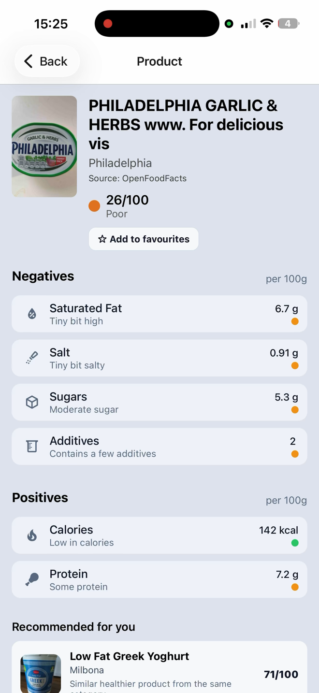
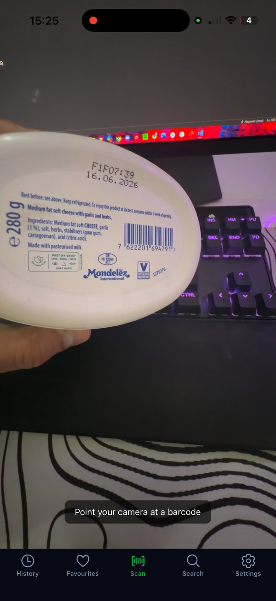
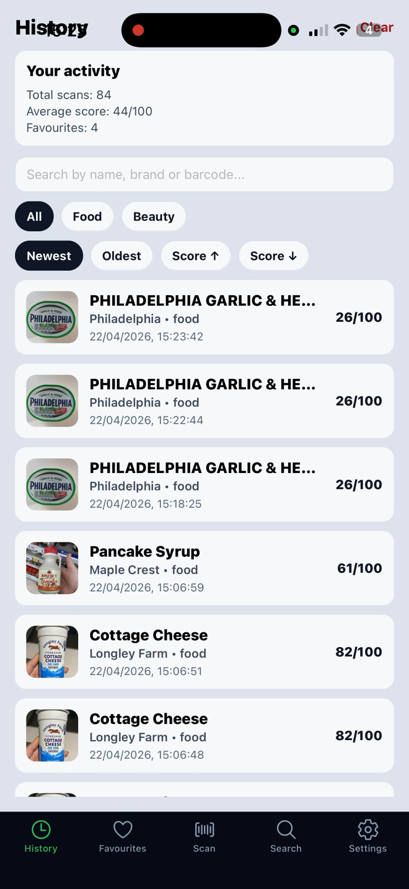
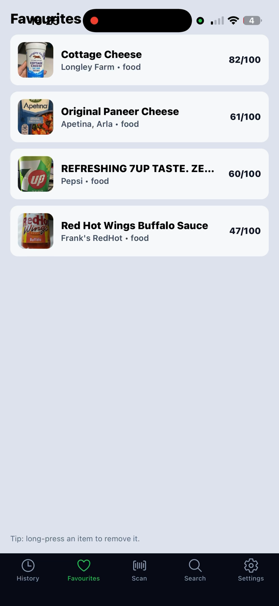
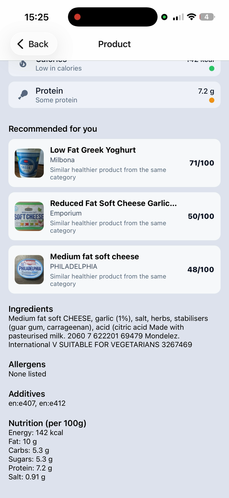

# 🥗 NutriScan

> A cross-platform mobile application that helps users make healthier food choices by scanning product barcodes, analysing nutritional information and generating personalised food recommendations.

---

# 📖 Overview

NutriScan is a **React Native** mobile application developed as a final-year Computer Science project. The application enables users to scan food product barcodes, retrieve nutritional information from the **OpenFoodFacts** API, calculate an easy-to-understand health score and receive personalised food recommendations based on their previous interactions.

The project combines **mobile application development**, **database design**, **REST API integration**, and a **rule-based recommendation system** to demonstrate practical software engineering skills. All user data is stored locally using SQLite, allowing the application to work without requiring user accounts or cloud storage.

---

# ✨ Features

- Scan food product barcodes
- Retrieve nutritional information from OpenFoodFacts
- Calculate a health score using nutritional values
- Save favourite products
- View scan history
- Search for products manually
- Receive personalised food recommendations
- View a simple nutrition analytics summary
- Store data locally using SQLite
- Delete individual history items
- Clear history with confirmation
- Fast database searches using SQLite indexes

---

# 🧠 Personalised Recommendation System

One of the key features of NutriScan is its personalised recommendation system.

The application learns from the user's behaviour by analysing:

- Previous scan history
- Favourite products
- Nutritional preferences

A simple user profile is built using average nutritional values such as:

- Sugar
- Salt
- Protein
- Fibre
- Saturated Fat
- Additives

Products that better match the user's nutritional profile receive a recommendation boost, allowing each user to receive recommendations that become more personalised over time.

---

# 🗄️ Database Design

SQLite is used as the local database because it provides fast, lightweight storage without requiring a backend server.

The application stores information in two main tables:

### History
Stores previously scanned products including:

- Barcode (EAN)
- Product name
- Brand
- Image
- Health score
- Timestamp
- Nutritional snapshot

### Favourites
Stores products the user has chosen to save for future reference.

To improve performance, indexes were created on:

- `ean`
- `scanned_at`

This allows faster searching and sorting as the amount of stored data grows.

---

# ⚙️ How It Works

1. The user scans a product barcode.
2. The barcode is sent to the OpenFoodFacts API.
3. Product information is retrieved.
4. A health score is calculated using nutritional values.
5. The scan is saved locally in SQLite.
6. User history and favourites are analysed.
7. Personalised recommendations are generated based on nutritional preferences.

---

# 🛠️ Tech Stack

### Mobile Development
- React Native
- Expo
- TypeScript

### Database
- SQLite

### APIs
- OpenFoodFacts API
- OpenBeautyFacts API

### Libraries
- React Navigation
- Axios
- Expo Barcode Scanner

---

# 🧪 Testing

The application was tested throughout development using several testing approaches, including:

- ✅ Functional testing
- ✅ Manual testing
- ✅ Database testing
- ✅ API testing
- ✅ Navigation testing
- ✅ Edge case testing
- ✅ Recommendation system testing

Example edge cases included:

- Invalid barcodes
- Products not found
- Missing nutritional values
- Duplicate scans
- Empty history and favourites

---

# 🚀 Future Improvements

Potential future enhancements include:

- 🤖 Machine learning recommendation models
- ☁️ Cloud synchronisation across devices
- 👤 User authentication
- 🥜 Allergy detection
- 🥦 Dietary preference filters
- 📈 Advanced nutrition analytics
- 🏆 Weekly health insights and progress tracking

---

# 📸 Video Demo and Screenshots

## 🎥 Video Demo

[▶️ Watch Demo](NutriScan-demo-video2.mp4)

> screenshots of App:

##  Screenshots

<table>
<tr>
<td align="center">
<b>📦 Product Screen</b> 

</td>

<td align="center">
<b>📷 Barcode Scanner</b> 

</td>
</tr>

<tr>
<td align="center">
<b>🕒 History</b> 

</td>

<td align="center">
<b>❤️ Favourites</b> 

</td>
</tr>

<tr>
<td align="center">
<b>🎯 Recommendations</b> 

</td>
</tr>
</table>

---

# 🎓 Learning Outcomes

This project strengthened my knowledge of:

- Mobile Application Development
- Software Engineering
- Database Design
- SQLite
- REST APIs
- TypeScript
- React Native
- Application Testing
- Recommendation Systems
- UI/UX Design

It also improved my problem-solving skills through debugging, performance optimisation, database schema design and implementing a personalised recommendation system.

---

# 👨‍💻 Author

**Harpreet Singh Roopra**

---

⭐ *If you found this project interesting, feel free to star the repository!*
